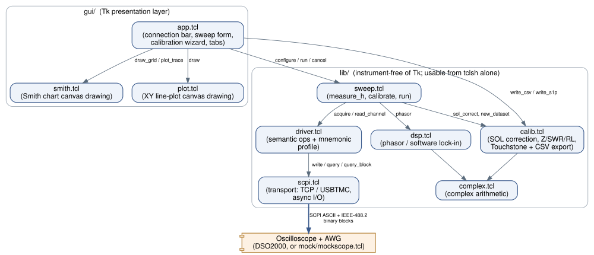

Architecture
============

Module map
----------

Everything under ``lib/`` is plain Tcl with no Tk dependency -- you can
``source lib/all.tcl`` from bare ``tclsh`` and drive a whole calibrated
sweep from a script, which is exactly what
``tests/mock_selftest.tcl`` does. ``gui/`` is the only layer that knows Tk
exists; it calls into ``lib/`` for every measurement and calibration
operation and never talks SCPI directly except through the console tab's
pass-through to :tcl:`aa::scpi::write`/:tcl:`query`.

Each module has one job:

``complex.tcl``
   Complex numbers as plain 2-element lists ``{re im}``, so a value is
   inspectable with a bare ``puts`` and flows through ordinary Tcl list
   commands. Every arithmetic proc coerces to ``double`` immediately after
   extracting its operands -- not just cosmetic, see the note in the
   module's own header about Tcl's integer-division behavior, and
   :doc:`testing` for the case that caught it.

``dsp.tcl``
   Turns a captured waveform into the complex amplitude of one frequency
   component: a single-bin, Hann-windowed DFT correlated against the known
   drive frequency, i.e. a software lock-in. :math:`O(N)` per channel,
   needs no power-of-two record length, and doesn't care that the
   generator and the scope's sample clock aren't synchronized.

``calib.tcl``
   One-port Short/Open/Load (SOL) error correction, plus
   :math:`\Gamma \to Z, \mathrm{SWR}, \mathrm{RL}` conversions and
   Touchstone/CSV export. See :doc:`calibration_theory` for the derivation.

``scpi.tcl``
   The only module that touches a socket or a device file. See
   `Why vwait, not a C extension or a coroutine`_ below.

``driver.tcl``
   Every literal SCPI mnemonic the app sends lives in one array here (see
   :doc:`scpi_reference`), behind semantic procs like
   :tcl:`::aa::driver::set_freq`. Nothing else in the app contains a SCPI
   string.

``sweep.tcl``
   Orchestration: one calibration-free measurement
   (:tcl:`::aa::sweep::measure_h`), a calibration sweep
   (:tcl:`::aa::sweep::measure_standard`), and the calibrated sweep
   (:tcl:`::aa::sweep::run`), each taking a status callback so the caller
   (the GUI, or a test) finds out about progress without polling.

``gui/smith.tcl``, ``gui/plot.tcl``
   Canvas drawing only -- no instrument or measurement logic. Both take a
   canvas widget and plain data in, and know nothing about SCPI, the sweep
   state, or Tk variables beyond what's needed to draw.

``gui/app.tcl``
   Orchestration for the UI: builds every widget, wires callbacks, and
   holds the few pieces of state (the current dataset, form values) that
   exist only because a human is driving.

One measurement point, end to end
------------------------------------

For a single swept frequency, :tcl:`::aa::sweep::measure_h` does:

1. :tcl:`::aa::driver::acquire $f $timebase` -- one compound SCPI line
   (frequency, timebase, trigger, ``*OPC?``) and one reply.
2. :tcl:`::aa::driver::read_channel 1` -- one compound query for
   ``:WAVeform:SOURce``:``:WAVeform:PREamble?`` (ASCII CSV reply: sample
   interval, point count, volts/code), then one ``:WAVeform:DATA?`` query
   returning an IEEE-488.2 binary block.
3. Step 2 again for channel 2.
4. :tcl:`::aa::dsp::phasor` on each channel's samples, then
   :tcl:`::aa::complex::cdiv` to get :math:`H = V_2/V_1`.

That's five SCPI round trips per point -- see :doc:`performance` for what
that costs in wall-clock time and why it's inherent to the approach, not a
bug to chase.

Why vwait, not a C extension or a coroutine
-----------------------------------------------

Two design decisions here are easy to get wrong, and both show up directly
in ``scpi.tcl`` and ``sweep.tcl``'s header comments:

**No ``TCP_NODELAY``.** Plain Tcl core sockets have no portable way to
disable Nagle's algorithm -- it would take a C extension (``critcl`` or a
custom package). Early in development, the sweep loop sent several small,
individually-unacknowledged writes per point (set frequency, set timebase,
trigger, as separate commands); on loopback TCP, each of those could stall
behind a delayed-ACK/Nagle interaction. The fix wasn't to fight Nagle --
it was to *compound* SCPI commands with ``;`` into one write per logical
operation, which is both the portable solution and, independently,
idiomatic SCPI usage. ``driver.tcl``'s ``acquire`` and ``read_channel`` are
built that way for exactly this reason.

**No Tcl ``coroutine``, despite an early sketch using one.** The obvious
way to keep a Tk GUI responsive during a multi-second network wait is to
run the sweep inside a ``coroutine`` and ``yield`` after each point. But
``scpi.tcl``'s ``query``/``query_block`` already wait for their reply via
``vwait`` on a non-blocking, ``fileevent``-armed channel -- and ``vwait``
re-enters Tcl's event loop while it blocks the *caller*. That means every
SCPI round trip the sweep makes already yields to Tk on its own: redraws
happen, and a Cancel click lands the moment the in-flight query returns.
Wrapping the sweep in a coroutine on top of that would be a second
cooperative-multitasking mechanism solving a problem the first one already
solved, so ``sweep.tcl::run`` is a plain, linear, easier-to-read proc, and
a module-level flag plus a disabled Run button handle cancellation and
re-entrancy respectively. A watchdog ``after`` inside the ``vwait`` helper
means a wrong mnemonic or a wedged instrument times out instead of hanging
the app forever.

Binary-safety: one more non-obvious channel setting
-------------------------------------------------------

Both transports configure their channel with ``-translation binary``, not
the more typical ``-translation {auto lf}``. The difference matters
specifically for ``:WAVeform:DATA?``'s IEEE-488.2 block: ADC sample bytes
are arbitrary 8-bit values, and a CR/LF auto-translation layer will
silently collapse a coincidental ``\r\n`` byte pair inside that binary
payload, corrupting the block and desynchronizing every read after it.
``binary`` translation still splits on ``\n`` for the ASCII command/reply
traffic (so ``gets``-based line reading is unaffected) while passing
8-bit data through byte for byte.
