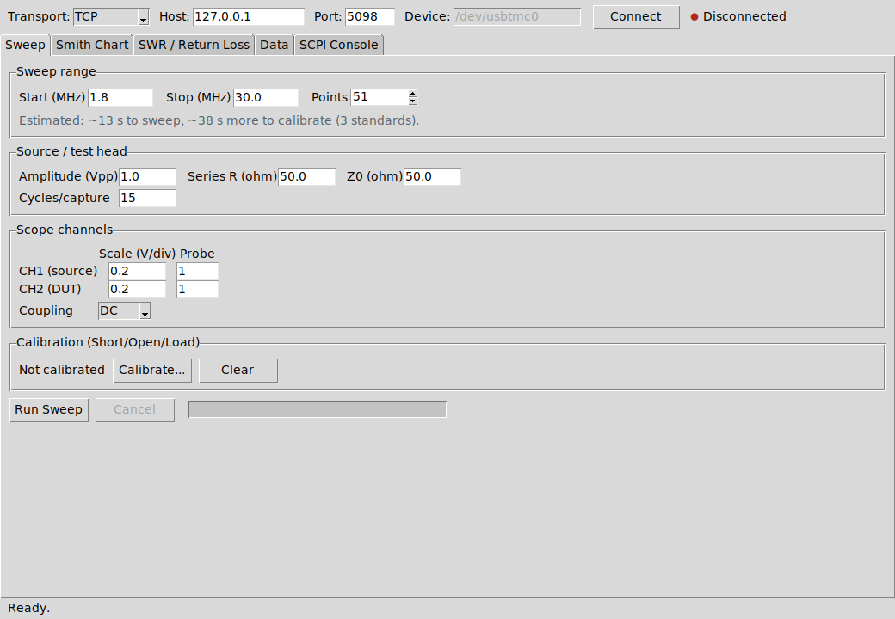
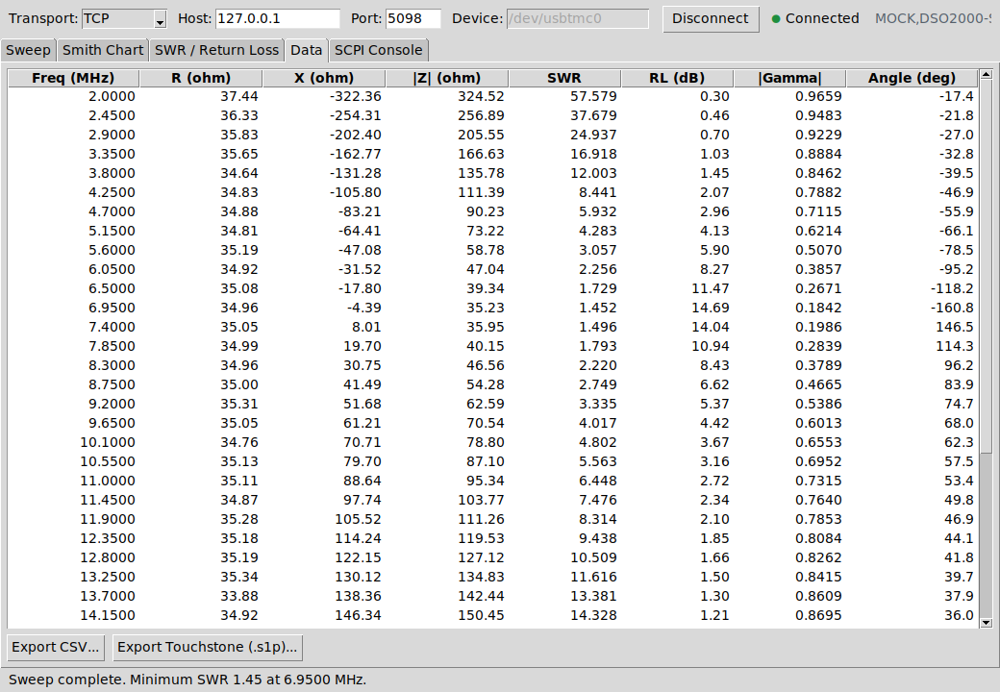
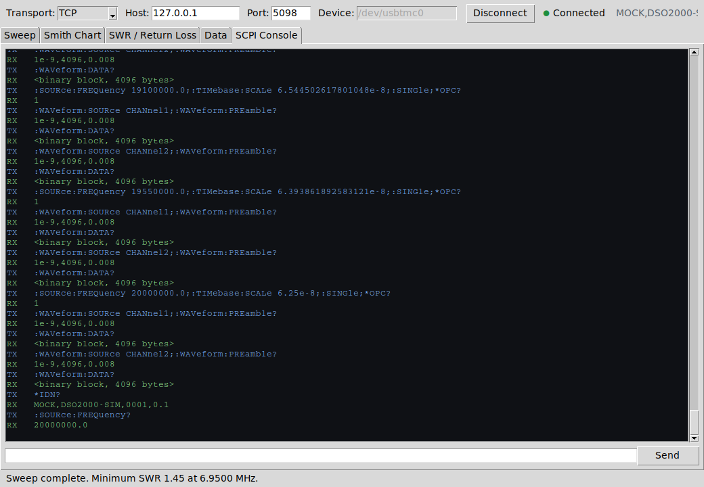

GUI Guide
=========

The window is a connection bar, a status bar, and a five-tab notebook in
between. All screenshots on this page are the real app, driven headlessly
against :doc:`the mock instrument <testing>` for reproducibility -- nothing
here is a mockup.

Connection bar
--------------

**Transport** selects ``TCP`` (a raw SCPI socket -- see
:doc:`scpi_reference`) or ``USBTMC`` (a Linux ``/dev/usbtmcN`` character
device); the Host/Port or Device fields enable accordingly. **Connect**
opens the link and issues ``*IDN?``; the status dot and the text next to it
reflect the result, and a failed connection shows the error in a dialog
rather than silently doing nothing.

Sweep tab
---------

Sweep range (start/stop in MHz, point count), source/test-head settings
(generator amplitude, the test head's series resistor value, :math:`Z_0`),
per-channel vertical scale/probe/coupling, the calibration wizard entry
point, and the Run/Cancel controls with a progress bar all live here. The
estimated-time line updates as you change the point count -- see
:doc:`performance` for where that estimate comes from.

Calibrating
~~~~~~~~~~~

**Calibrate...** walks through Short, Open, and Load in order, each as a
confirmation dialog ("connect the standard, click OK") followed by a sweep
across the configured frequency list against that standard. **Clear**
discards a stored calibration. Running a sweep with no calibration still
works -- :tcl:`aa::sweep::run` falls back to an uncorrected :math:`2H-1`
estimate (see :doc:`calibration_theory`) -- but the status bar says so.

.. image:: images/gui_03_calibrated.png
   :width: 100%
   :alt: calibration complete, ready to sweep

Running a sweep
~~~~~~~~~~~~~~~~

.. image:: images/gui_04_sweep_done.png
   :width: 100%
   :alt: sweep complete, minimum SWR reported in the status bar

The progress bar and status text update after every point (not just at the
end), and so do the Smith chart, the SWR/RL charts, and the data table on
their respective tabs -- flip to any of them mid-sweep and watch the trace
grow. **Cancel** stops after the in-flight point and keeps whatever was
collected so far; the status bar says the sweep was cancelled and how many
points it kept, rather than silently discarding them.

Smith Chart tab
----------------

.. image:: images/gui_05_smith_chart.png
   :width: 100%
   :alt: Smith chart with a hovered marker and readout

A standard :math:`Z_0`-normalized Smith chart (grid math in
:doc:`architecture`). Moving the mouse snaps a marker to the nearest swept
point and updates the readout line at the bottom with frequency, complex
impedance, ``|Gamma|``, SWR, and return loss.

SWR / Return Loss tab
----------------------

.. image:: images/gui_06_swr_rl_chart.png
   :width: 100%
   :alt: SWR and return loss vs frequency

Two stacked plots sharing the same frequency axis: SWR (log-scaled, since it
can span orders of magnitude away from resonance, with a dashed SWR=2
reference line) and return loss in dB. Hovering either one moves a cursor
on both and updates the same bottom readout as the Smith chart tab.

Data tab
--------

Every swept point as a row: frequency, R, X, ``|Z|``, SWR, RL, ``|Gamma|``,
and angle. **Export CSV...** and **Export Touchstone (.s1p)...** are
available here and from the File menu.

SCPI Console tab
------------------

A live log of every command sent and every reply received -- color-coded by
direction (``TX``/``RX``/``ERR``/``INFO``) -- plus a one-line entry for
sending commands by hand: anything ending in ``?`` is sent as a query (and
its reply logged), anything else as a plain write. This is also just a
convenient way to poke at a real instrument's actual mnemonics while
adapting :doc:`the driver profile <scpi_reference>`.

Menus
-----

**File** duplicates the two export commands and Quit. **Instrument** offers
a manual ``*RST`` and an ``*IDN?`` query (shown in a dialog) independent of
the connection bar. **Help \u2192 About** shows the app name/version.
