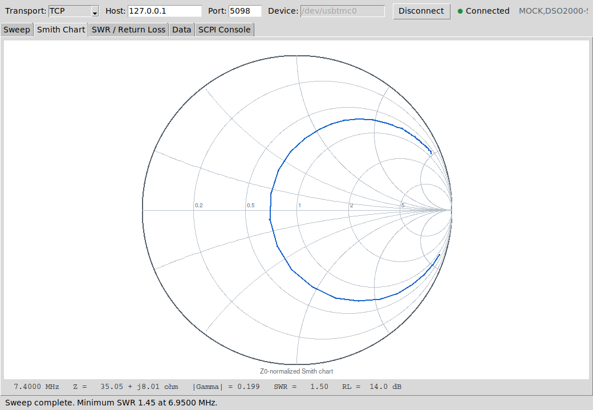

Tcl/Tk Antenna Analyzer
========================

A two-channel-oscilloscope-plus-signal-generator **vector reflection
analyzer**: it turns a DSO2000-family scope with a built-in arbitrary
waveform generator into an instrument that sweeps frequency, measures
complex reflection coefficient (:math:`\Gamma`), and reports impedance,
SWR, and return loss for an antenna or any one-port device -- entirely
over SCPI, with a Tcl/Tk GUI on top.

This is a hobbyist/educational project, not a commercial product: the
underlying measurement (a resistive voltage divider sampled by two scope
channels) is far simpler than a real VNA, and its accuracy is limited more
by connector repeatability and channel matching than by the oscilloscope's
own resolution. What it *does* give you is a fully worked example of
driving real test equipment from Tcl over SCPI -- transport, error-queue
handling, binary IEEE-488.2 block transfers, synchronization -- wrapped in
a usable GUI, start to finish.

.. note::

   This project is under active development.

.. toctree::
   :maxdepth: 2
   :caption: Getting started

   installation
   quickstart
   gui_guide

.. toctree::
   :maxdepth: 2
   :caption: How it works

   architecture
   schematics
   calibration_theory
   scpi_reference
   performance

.. toctree::
   :maxdepth: 2
   :caption: Reference

   api/index
   testing
   troubleshooting
   changelog

Repository layout
------------------

.. code-block:: text

   antenna_analyzer/
     bin/
       antenna_analyzer.tcl     entry point: wish bin/antenna_analyzer.tcl
     lib/                       instrument-free of Tk; usable from plain tclsh
       complex.tcl               complex-number arithmetic
       dsp.tcl                   single-bin DFT phasor extraction (software lock-in)
       calib.tcl                 SOL calibration, Gamma -> Z/SWR/RL, Touchstone/CSV export
       scpi.tcl                  transport-agnostic SCPI client (TCP + USBTMC)
       driver.tcl                semantic instrument operations + mnemonic profile
       sweep.tcl                 measurement/calibration/sweep orchestration
       all.tcl                   sources the above in dependency order
     gui/                        Tk presentation layer
       app.tcl                   the application
       smith.tcl                 Smith chart canvas drawing
       plot.tcl                  XY line-plot canvas drawing
     mock/
       mockscope.tcl             simulated scope+generator for development without hardware
     tests/
       unit.test                 tcltest suite for lib/complex, dsp, calib
       mock_selftest.tcl         end-to-end test against mock/mockscope.tcl
     docs/                       this site (Sphinx)

Indices
-------

* :ref:`genindex`
* :ref:`search`
