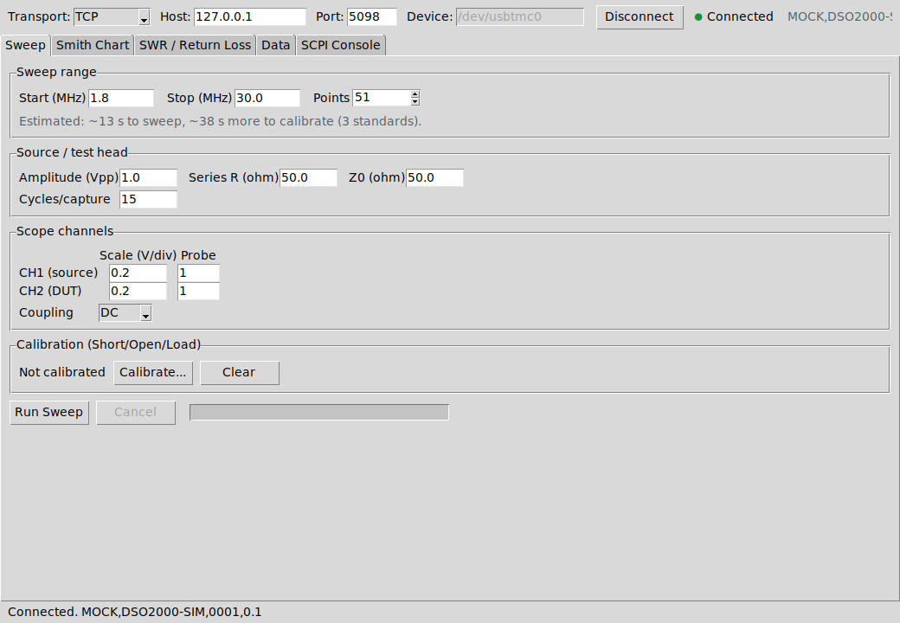
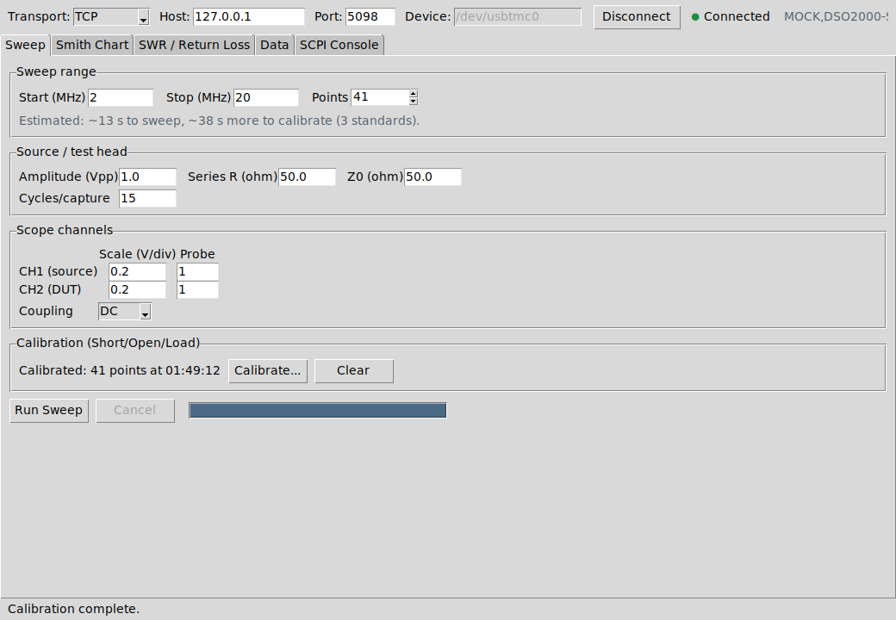
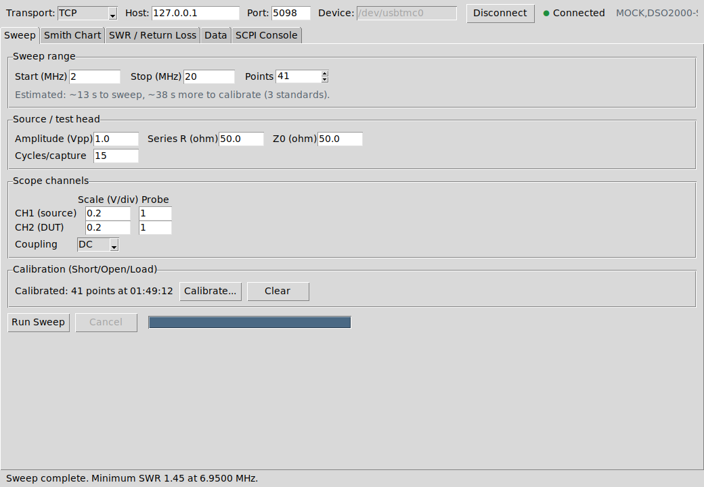
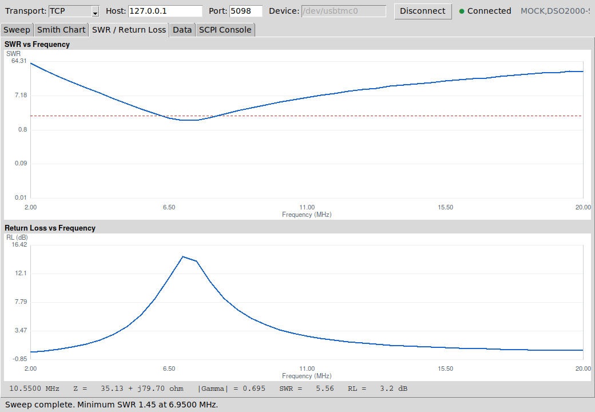

Quickstart
==========

This walks through a first sweep using the bundled mock instrument, so you
can see the whole app work with no hardware attached, then switch to a real
scope.

1. Launch the mock instrument
------------------------------

In one terminal:

.. code-block:: console

   tclsh src/mock/mockscope.tcl 5025

This simulates a scope+generator with a ~7.1 MHz series-RLC "antenna" on its
test port (see :doc:`testing` for what it models and why). It speaks the
exact same SCPI dialect the app's default :ref:`mnemonic profile
<scpi-reference>` expects, so everything downstream behaves exactly as it
would against real hardware.

2. Launch the app
------------------

In a second terminal:

.. code-block:: console

   wish src/bin/antenna_analyzer.tcl

3. Connect
----------

Leave **Transport** as ``TCP``, **Host** as ``127.0.0.1``, set **Port** to
``5025``, and click **Connect**. The status dot turns green and the
instrument's ``*IDN?`` response appears alongside it.

4. Set a sweep range and calibrate
------------------------------------

Set **Start** / **Stop** to something like ``2`` / ``20`` MHz and leave
**Points** at its default. Click **Calibrate...**; the wizard will prompt
for a short, then an open, then a 50 :math:`\Omega` load, measuring the full
frequency list against each. Against the mock instrument, send
``:SIMulate:DUT SHORT`` (then ``OPEN``, then ``LOAD``) at the
:doc:`SCPI console <gui_guide>` tab right before clicking **OK** at each
prompt -- that's the mock's stand-in for physically swapping a connector.

5. Run the sweep
------------------

Send ``:SIMulate:DUT ANT`` at the console (to switch the mock back to its
simulated antenna), then click **Run Sweep**. The Smith chart, the SWR/RL
charts, and the data table all fill in live as each point arrives.

6. Look at the result
------------------------

Switch to the **Smith Chart** or **SWR / Return Loss** tab and move the
mouse over the trace: a readout at the bottom tracks the nearest swept
frequency's impedance, ``|Gamma|``, SWR, and return loss.

7. Export
----------

From the **Data** tab (or the File menu), **Export CSV...** writes a
spreadsheet-friendly table; **Export Touchstone (.s1p)...** writes a
standard single-port Touchstone file any RF CAD tool or NanoVNA-Saver-style
app can load for cross-checking.

Next steps
----------

* Point **Host**/**Port** at your real instrument's SCPI LAN port (or switch
  **Transport** to ``USBTMC`` and set **Device**), and see
  :doc:`scpi_reference` for adapting the command set if your scope's
  mnemonics differ from the defaults.
* Read :doc:`calibration_theory` for what the Calibrate step is actually
  doing and why it matters.
* Read :doc:`performance` before assuming a slow sweep is a bug -- it
  probably isn't.
