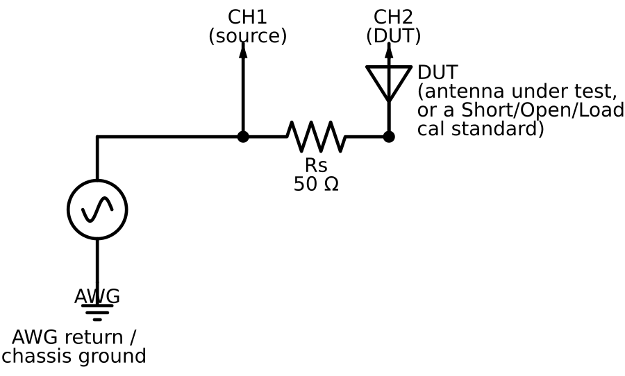

Schematics
==========

The analog test head
----------------------

The whole analog front end is a resistive voltage divider: the generator
drives node A through a series resistor :math:`R_s` (nominally
:math:`50\,\Omega`, matching :math:`Z_0`) into the device under test at
node B. CH1 and CH2 sample A and B *simultaneously* on every acquisition,
so :tcl:`::aa::dsp::phasor` can recover both amplitude and phase of each,
not just amplitude -- which is what makes a *vector* measurement (complex
:math:`\Gamma`, not just SWR) possible with nothing more exotic than a
two-channel scope.

With :math:`H = V_2/V_1` and the DUT's admittance :math:`Y_{\mathrm{dut}}`:

.. math::

   H = \frac{1}{1 + R_s Y_{\mathrm{dut}}}

:math:`V_1` is measured directly (not assumed), so the generator's actual
output level and source impedance drop out of the result entirely --
that's the whole reason to sample both nodes instead of trusting the
generator's programmed amplitude.

What's connected at the DUT position changes over the course of a
calibrated sweep: first a short, then an open, then a 50 :math:`\Omega`
load (each a point on the ``mock/mockscope.tcl`` simulator too, via its
``:SIMulate:DUT`` back door), and finally the antenna itself. See
:doc:`calibration_theory` for why three known standards are enough to
correct for everything *between* the generator and the DUT -- cable
length, probe capacitance, channel gain/skew mismatch -- without knowing
any of those error terms individually.

Building the test head in practice
--------------------------------------

* :math:`R_s` doesn't need to be exactly :math:`50\,\Omega` -- the math
  above (and ``sweep.tcl``'s ``rs`` setting) uses whatever value you
  measure it at -- but close to :math:`Z_0` keeps the divider's sensitivity
  roughly balanced across the SWR range you care about. A 1% metal-film
  resistor is plenty; this isn't the accuracy bottleneck.
* Keep leads short and symmetric between the two probe tap points and the
  resistor; stray inductance here looks exactly like antenna reactance and
  calibration can only remove what's *consistent* between the calibration
  standards and the DUT measurement, not physically-different lead
  geometry introduced by a sloppy connection.
* A BNC tee at node A and another at node B, with the probes clipped on
  there, is a perfectly good way to build this on a bench -- no PCB
  required.
* Common-mode current on the coax feeding the antenna can couple back into
  the measurement; a few turns through a ferrite choke on the feedline
  near the test head is cheap insurance.
* Keep drive amplitude low (the default is 1 Vpp) -- there's no need for
  much power for a reflection measurement, and it keeps you well inside
  the scope's linear range without needing attenuators.

Calibration standards
-----------------------

* **Short**: as close to an ideal zero-length short as you can manage at
  the reference plane (node B) -- a stub of wire introduces exactly the
  series inductance error calibration is trying to characterize away.
* **Open**: literally nothing connected (or a true open-circuit standard,
  if your connector type has one) -- the mock models a touch of stray
  parallel capacitance here on purpose, since a real open always has some.
* **Load**: the best 50 :math:`\Omega` resistor you have. This is usually
  the accuracy-limiting standard in a home-built setup; it's worth using a
  precision resistor if you have one.

Reconnect the short after calibrating as a sanity check: a corrected sweep
of the short standard itself should land almost exactly on
:math:`\Gamma = -1` (dead left on the Smith chart, SWR effectively
infinite). See the note on the SOL formula's numerical behavior at exactly
that point in :doc:`calibration_theory`.
